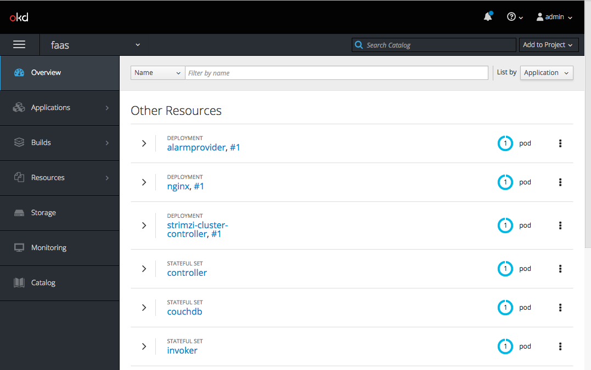
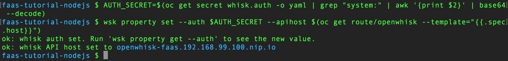
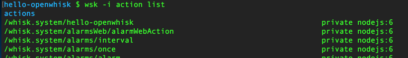
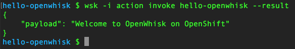
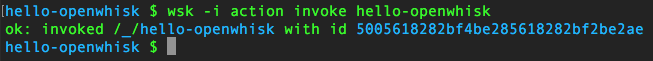
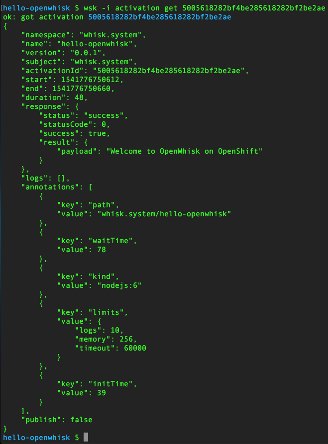
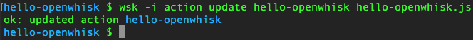
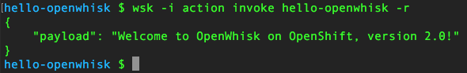
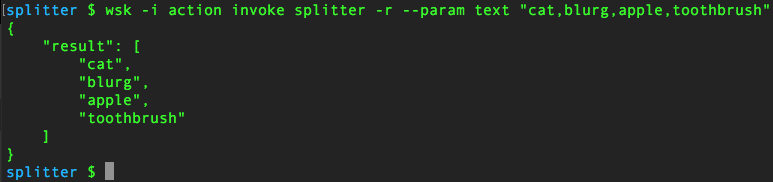

---
# Feel free to add content and custom Front Matter to this file.
# To modify the layout, see https://jekyllrb.com/docs/themes/#overriding-theme-defaults

layout: home
---

    
# FaaS Tutorial using Node.js and React

(C) 2018 <a href="https://developers.redhat.com">Red Hat Developer</a>

This tutorial guides you to a working knowledge of how to build functions using Node.js on the open source Function as a Service (FaaS) platform <a href="https://openwhisk.apache.org/">OpenWhisk</a>.

<strong>Note:</strong> FaaS is also commonly referred to as "serverless computing" or simply "serverless".

## Prerequisites
You will need the following to execute this tutorial on your local PC.

### <a href="https://github.com/minishift/minishift">Minishift</a>
Minishift allows you to run OpenShift and the entire OpenWhisk environment inside a Virtual Machine (VM) on your PC.

### <a href="https://www.docker.com/get-started">docker</a>
docker allows the Linux containers used by OpenWhisk to run.

### <a href="https://kubernetes.io/docs/tasks/tools/install-kubectl/">Kubernetes CLI (kubectl)</a>
kubectl allows you to run Kubernetes commands on your PC

### <a href="https://docs.openshift.com/container-platform/3.10/cli_reference/get_started_cli.html">OpenShift CL (oc)</a>
oc allows you to run OpenShift commands on your PC

### <a href="https://github.com/apache/incubator-openwhisk-cli/releases">OpenWhisk CLI (wsk)</a>
wsk allows you to run OpenWhisk commands on your PC

### <a href="https://git-scm.com/">Git CLI (git)</a>
git allows you to work with Github repositories (repos) on your PC

### <a href="https://www.npmjs.com/get-npm">npm</a>
npm allows you to manage Node.js packages on your PC

### watch
Command-line tool to watch for output. Install on MacOS using `brew install watch`

## Starting Minishift

*Don't foget to add the location of Minishift executable to your PATH*

`minishift profile set faas-tutorial-nodejs`  
`minishift config set memory 8GB`  
`minishift config set cpus 3`  
`minishift config set image-caching true`  
`minishift addon enable admin-user`  
`minishift addon enable anyuid`  
`minishift start`  
`minishift ssh -- sudo ip link set docker0 promisc on`  

### Important

`minishift ssh -- sudo ip link set docker0 promisc on` command needs to be execute each time Minishift is restarted.


## Setting Up Your Environment

`eval $(minishift oc-env`  
`eval $(minishift docker-env`

## Setting Up OpenWhisk

The project <a href="https://github.com/projectodd/openwhisk-openshift">OpenWhisk on OpenShift</a> provides the OpenShift templates required to deploy Apache OpenWhisk.

Log in as the admin  
`oc login $(minishift ip):8443 -u admin -p admin`

It is always better to group related classes of applications. Create a new OpenShift project called "faas" to deploy all OpenWhisk applications.  
`oc new-project faas`

Deploy OpenWhisk applications to "faas" project in OpenShift.  
`oc process -f https://git.io/openwhisk-template | oc create -f -`

### Waiting for OpenWhisk to start...

It will take a few minutes until all of the required OpenWhisk pods are running and the FaaS is ready for some load. You can watch the status using the command:  
`watch -n 5 'oc logs -f controller-0 -n faas | grep "invoker status changed"'`

## Verifying The Deployment

You can start the OpenShift console in your default browser by using the following command:  
`minishift console`

When the console login appears in your browser window, log in using admin/admin as the username and password combination. Select the project "faas" and you will then see a screen like the following:  


#### At this point you have a working OpenWhisk FaaS environment running in OpenShift, using Minishift, on your local machine.

## Configuring The OpenWhisk CLI Tool, wsk

 Verify that the OpenWhisk CLI tool in your path by running the following command:  
`wsk --help`

The OpenWhisk CLI needs to be configured to know where the OpenWhisk instance is located and the authorization that is to be used to invoke `wsk` commands.  Run the following two commands to have that setup:  
`AUTH_SECRET=$(oc get secret whisk.auth -o yaml | grep "system:" | awk '{print $2}' | base64 --decode)`  
`wsk property set --auth $AUTH_SECRET --apihost $(oc get route/openwhisk --template="{{.spec.host}}")`  

Successful setup of wsk will show output like this:  


In this case the OpenWhisk API Host is pointing to the local Minishift nip.io address `openwhisk-faas.192.168.99.100.nip.io`. To verify if wsk CLI is configured properly run `wsk -i action list`. This will list some actions which are installed as part of the OpenWhisk setup.

#### Note
The `nginx` in OpenWhisk deployment uses a self-signed certificate.  To avoid certificate errors when using `wsk`, you need to add `wsk -i` to each of your `wsk` commands. For convenience, you can add an alias to your profile with `alias wsk='wsk -i'`. 

## Setting Up The Development Environment

Clone the tutorial repo using the following command:  
`git clone https://github.com/redhat-developer-demos/faas-tutorial-nodejs.git`

For the rest of the tutorial, the directory into which this repo is placed will be referred to as $PROJECT_HOME.

## Your First OpenWhisk Action

### What is an action?

**Actions** are stateless code snippets that run on the OpenWhisk platform. OpenWhisk Actions are thread-safe meaning at a given point of time only one invocation happens.

For more details refer the <a href="https://openwhisk.apache.org/documentation.html">official documentation</a>.

Move into the ./solutions/hello-openwhisk directory and view the file hello-openwhisk.js:  
`cd solutions/hello-openwhisk`  
`cat hello-openwhisk.js`  

You will see the following Node.js code:
```javascript
function main() {
    return {payload: 'Welcome to OpenWhisk on OpenShift'};
}
```

This example illustrates that an OpenWhisk function will return a JSON document. In this case, it's hard-coded.  

Use the following command to create an OpenWhisk 'action' by using the following command:  

`wsk --insecure action create hello-openwhisk hello-openwhisk.js`  

Some things to note:
1. The '--insecure' option is because we are operating in an insecure environment (a self-signed certificate). This option can be abbreviated as '-i'.
2. The action name will be 'hello-openwhisk'.
3. The name of the source code file -- in this case 'hello-openwhisk.js' does *not* need to match the name of the function. However, this is probably a Best Practice.

Given the success of the command, we now have an action named 'hello-openwhisk'. We can see this listed by using the following command:  

`wsk -i action list`  

The command will yield a result similar to the following (you should see 'hello-openwhisk' at or near the top of your list):  



Now we can invoke the function.  

Use the following command to invoke the OpenWhisk "hello-openwhisk" function:  

`wsk -i action invoke hello-openwhisk --result`  

You will see the following output:  

  

The results displayed are as expected. If you repeat the command multiple times, you will notice an improvement in performance over the first invocation. That's because OpenWhisk has started the action and is now keeping the Kubernetes pod available. This availability defaults to five minutes; if there is no activity for an action within five minutes, it "goes to sleep" until invoked again.  

Note the '--result' option of the command. This runs the action synchronously; that is, we will wait for the result before returning control to the caller -- in this case, the 'wsk' command line tool.  

An action can be called asynchronously, in which case control is immediately returned to the caller with an Activation ID. This Activation ID can then be used to get the results.

Use the following command to invoke the OpenWhisk "hello-openwhisk" function asynchronously, getting an Activation ID in return:

`wsk -i action invoke hello-openwhisk`

Your result will be much like the following but with a different Activation ID:



You can use that Activation ID to get the results.

Use the following command to retrieve the Activation associated with the Action invocation, substituting your Activation ID:

`wsk -i activation get {activation_id}`

Your result will be similar to the following. Note that, in this case, instead of simply the 'result' value, the entire JSON object is available:



Hint: You can access the latest Activation by running `wsk -i activation get --last`

## Updating an existing action
Updating an existing action is as simple as a code change and one command.

Change the contents of 'hello-openwhisk,js' to return a different message, such as the following:

```javascript
function main() {
    return {payload: 'Welcome to OpenWhisk on OpenShift, version 2.0!'
};
```

With the code changed, updating the Action is one command.

Use the following command to update the Action 'hello-openwhisk':  

`wsk -i action update hello-openwhisk hello-openwhisk.js`



Use the following command to invoke the Action (Note: '--result' can be shortened to '-r')

`wsk -i action invoke hello-openwhisk -r`

  
  
  
## Deleting an existing Action
Use the following command to delete the Action:

`wsk -i action delete hello-openwhisk`

 
### Recap
Up to this point, you've learned how to create, update, and delete a simple Action that returns a hard-coded string. In the next section, you'll see how to handle input parameters to your Action.  

---

## Handling Action parameters

OpenWhisk Actions receive JSON objects as input. In this example, the Action 'splitter' will receive a JSON object with a comma-delimted string of words and will return a JSON object with an array of the words.

For example: An input of  

```JSON
{text: "cat,blurg,apple,toothbrush"} 
```
will return the following:
```JSON
{
    "result": [
        "cat",
        "blurg",
        "apple",
        "toothbrush"
    ]
}
```

Use the following command to move into the directory containing the 'splitter' code:

`cd ../sequence-demo/splitter`

Optional: Examine the code for the function:

`cat splitter.js`

Notice that the input JSON is expected to contain the property '.text', which will contain the string of comma-separated words.

Create the OpenWhisk function 'splitter' using the code in file 'splitter.js'.

`wsk -i action create splitter splitter.js`

Use the following command test invoke the Action 'splitter' using the example, above:

`wsk -i action invoke splitter -r --param text "cat,blurg,apple,toothbrush"`

You should see the following results:

